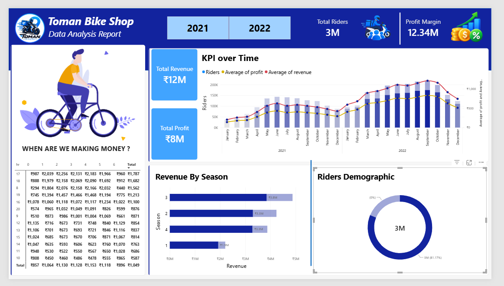

# Toman Bike Shop – Data Analysis



A Power BI dashboard for **Toman Bike Share** that tracks key performance metrics across 2021–2022 and supports a pricing decision for the following year.

## Business Request

The client asked for a dashboard covering:

- Hourly revenue analysis
- Profit and revenue trends
- Seasonal revenue
- Rider demographics

They also asked for a recommendation on raising prices next year. The full request is in [docs/analysis-request.md](docs/analysis-request.md).

## Project Structure

```
toman-bike-shop-data-analysis/
├── assets/
│   └── images/              # Dashboard preview and icons used in the report
├── dashboard/
│   ├── Toman-Bike-Riders.pbix   # Power BI report
│   └── Toman-Bike-Riders.pdf    # PDF export of the report
├── data/
│   ├── bike_share_yr_0.csv  # Hourly rider data for 2021
│   ├── bike_share_yr_1.csv  # Hourly rider data for 2022
│   └── cost_table.csv       # Price and COGS per year
├── docs/
│   ├── analysis-request.md  # Client email / requirements
│   └── recommendation.md    # Pricing recommendation
├── sql/
│   └── gathering-data.sql   # Combines yearly data and calculates revenue and profit
└── README.md
```

## Data

| File | Description |
|------|-------------|
| `bike_share_yr_0.csv` | Hourly records for 2021: date, season, hour, weekday, weather, rider type, rider count |
| `bike_share_yr_1.csv` | Same structure for 2022 |
| `cost_table.csv` | Price and COGS per year (`yr` 0 = 2021, 1 = 2022) |

## Workflow

1. **Database** – Load the CSV files into SQL Server as tables.
2. **Data preparation** – [sql/gathering-data.sql](sql/gathering-data.sql) unions both years, joins the cost table, and calculates:
   - `revenue = riders * price`
   - `profit = riders * price - COGS`
3. **Dashboard** – Connect Power BI to the query output and build the visuals in [dashboard/Toman-Bike-Riders.pbix](dashboard/Toman-Bike-Riders.pbix).

## Dashboard Highlights

- **KPI cards** – Total revenue, total profit, total riders and profit margin, filterable by year
- **KPI over time** – Monthly riders with average revenue and profit trends
- **When are we making money?** – Revenue matrix by hour and weekday
- **Revenue by season** – Seasonal revenue comparison
- **Rider demographics** – Casual vs. registered rider split

## Pricing Recommendation

After a large price increase the previous year, a conservative **10–15% increase** is recommended (from $4.99 to roughly $5.49–$5.74), alongside market research, segmented pricing for casual vs. registered riders, and close monitoring after rollout. See [docs/recommendation.md](docs/recommendation.md) for details.

## Tools

- SQL Server
- Power BI
